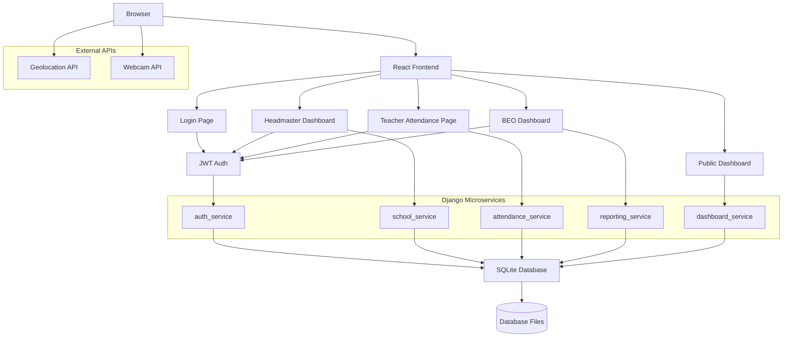

# System Architecture Diagram

This diagram illustrates the high-level architecture of the Teacher Attendance & Proxy Verification System.

## Architecture Overview

The system follows a microservices architecture simulated within a single Django project for simplicity. Services communicate via internal HTTP calls. The frontend is a React SPA with role-based routing. Authentication uses JWT tokens. Data is stored in SQLite.

## Component Descriptions

- **React Frontend**: Single-page application with Vite, Tailwind CSS, mobile-first design.
- **Microservices**: Separate Django apps for different domains, communicating via REST APIs.
- **Database**: Single SQLite file with logical table separation.
- **External APIs**: Browser geolocation for location validation, webcam for selfie capture.
- **Authentication**: JWT tokens issued by auth_service, validated by all services.

For production, an API Gateway (e.g., NGINX) could be added to route external requests, but internal calls are direct for this submission.