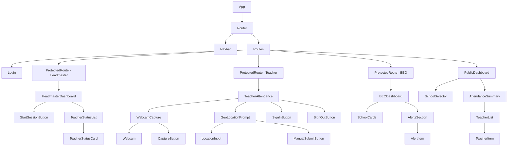

# React Component Hierarchy

This diagram shows the component tree of the React frontend application.

## Component Hierarchy

## Explanation

- **App**: Root component with router and toaster.
- **Navbar**: Top navigation with login/logout.
- **Routes**: Protected routes for different roles.
- **Dashboards**: Role-specific pages with sub-components.
- **Shared Components**: WebcamCapture, GeoLocationPrompt used in TeacherAttendance.

This hierarchy matches the actual file structure in src/components/ and src/pages/.