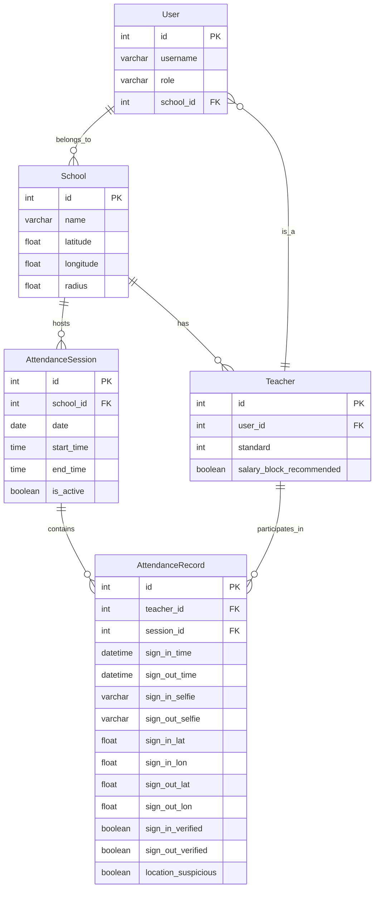

# Database ER Diagram

This document contains the Entity-Relationship diagram for the Teacher Attendance & Proxy Verification System database.

The system uses a single SQLite database with logical separation into microservices. Each service's models are prefixed or grouped logically, but all tables share the same database file for simplicity.

## ER Diagram

## Explanation

- **User**: Central authentication model with role-based access.
- **School**: Represents each ZPPS school with geo-coordinates and radius for validation.
- **Teacher**: Extends User with class standard and salary block flag.
- **AttendanceSession**: Daily sessions created by headmasters.
- **AttendanceRecord**: Individual attendance entries with selfies and locations.

Relationships:
- One-to-Many: School to Teachers, School to Sessions, Session to Records, Teacher to Records.
- One-to-One: User to Teacher (since teacher is a user role).

The microservice split is logical: auth_service manages User, school_service manages School and Teacher, attendance_service manages Sessions and Records, etc. No separate databases; all in one SQLite file for submission simplicity.